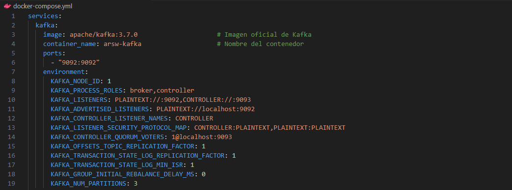
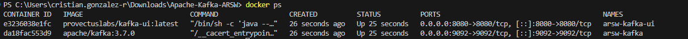
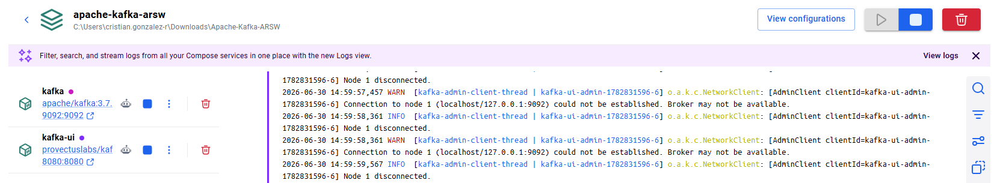
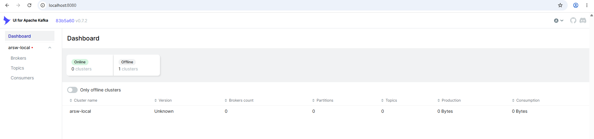
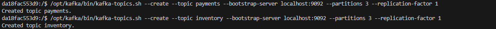
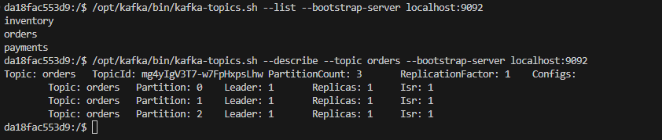
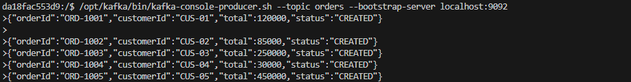
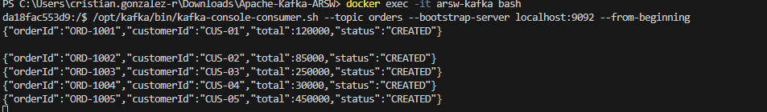

# Apache-Kafka-ARSW

### Actividad 1.  Análisis de comunicación 
Para una tienda en línea, clasifique qué procesos deberían ser síncronos, asíncronos o híbridos: consultar productos, crear pedido, validar pago, enviar notificación, actualizar analítica y registrar auditoría. Justifique brevemente su decisión.

| Proceso | Tipo de Comunicación | Justificación |
|----------|----------------------|---------------|
| Consultar productos | **Síncrono (REST)** | Es una operación que requiere una respuesta inmediata para mostrar la información al usuario. La latencia debe ser mínima. |
| Crear pedido | **Híbrido** | La creación inicial puede ser síncrona para devolver un `orderId` y un estado inicial (`CREATED`) al usuario. Los procesos posteriores (validación de pago, reserva de inventario) se disparan de forma asíncrona. |
| Validar pago | **Asíncrono (Kafka)** | Aunque debe ser rápido, no es necesario que el usuario espere la respuesta. Si falla, se puede notificar por otro medio. Kafka permite desacoplar el servicio de pagos y reintentar en caso de fallos. |
| Enviar notificación | **Asíncrono (Kafka)** | Este proceso no afecta la transacción principal. Si falla, el pedido ya está creado. Kafka permite procesar grandes volúmenes de notificaciones sin ralentizar el flujo principal. |
| Actualizar analítica | **Asíncrono (Kafka)** | Son procesos de fondo para la toma de decisiones. No necesitan ser en tiempo real y pueden consumir grandes cantidades de datos desde Kafka. |
| Registrar auditoría | **Asíncrono (Kafka)** | Es fundamental para la trazabilidad. Kafka, como un log distribuido, es perfecto para almacenar y reprocesar estos eventos históricos. |

## Actividad 2 – Decisiones de configuración

### Configuración analizada

orders 

### Riesgos identificados

1. **Una sola partición**: no permite paralelismo. Todo el trabajo recae sobre un único consumidor por Consumer Group, generando un cuello de botella a medida que aumenta el volumen de pedidos.
2. **Factor de replicación 1**: no existe tolerancia a fallos. Si el broker que almacena la partición falla, los eventos se pierden de forma permanente.
3. **Mensajes sin clave**: al no usar una clave de particionamiento (por ejemplo `orderId`), no se garantiza que los eventos relacionados con un mismo pedido se procesen en orden, ya que podrían distribuirse en particiones distintas.
4. **Retención de 24 horas**: es insuficiente para reprocesamiento o auditoría. Si un consumidor falla por más de un día, pierde la posibilidad de leer eventos antiguos desde el principio.

### Mejoras propuestas para un ambiente productivo

| Aspecto | Configuración actual | Mejora propuesta | Justificación |
|---|---|---|---|
| Particiones | 1 | 3 o más (según volumen esperado) | Permite paralelismo entre consumidores de un mismo grupo y mejora la escalabilidad |
| Replicación | 1 | 3 | Tolerancia a fallos: si un broker cae, otra réplica puede asumir el liderazgo sin pérdida de datos |
| Clave de partición | Sin clave | `orderId` | Garantiza que todos los eventos de un mismo pedido se procesen en orden, ya que caen en la misma partición |
| Retención | 24 horas | Ampliar según necesidades de auditoría y reprocesamiento (ej. 7 días o más) | Permite recuperar y reprocesar eventos ante fallos prolongados de un consumidor, y soporta análisis histórico |

### Conclusión

La configuración inicial es aceptable únicamente para un entorno de laboratorio/pruebas, pero en producción comprometería la **disponibilidad** (sin replicación), la **escalabilidad** (sin particiones suficientes), la **consistencia** (sin clave de particionamiento) y la **capacidad de recuperación** (retención corta). Por eso es necesario ajustar estos parámetros antes de llevar la solución a un ambiente real.

## Actividad 3 

Cree los topics orders, payments e inventory. Publique al menos cinco eventos JSON y verifique en Kafka UI su topic, partición, offset, clave y contenido.

Creamos el Docker Compose.yml

Se crear el Docker

Verificamos que este corriendo 

Con eso abrimos en:

**http://localhost:8080**

Acceder al Contenedor de Kafka

Crear los Topics 'orders' con 3 particiones y factor de replicación 1

Crear topic 'payments' y 'inventory'

Verificar los Topics Creados

Publicar Eventos (Productor)

**/opt/kafka/bin/kafka-console-producer.sh --topic orders --bootstrap-server localhost:9092**

Consumir Eventos (Consumidor)

